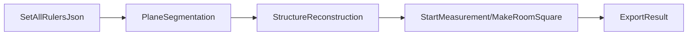

# PointReconstruction 深度技术手册（代码走读版）

> 目标：让你可以“顺着代码吃透工程”。
> 证据原则：本手册只基于仓库代码证据（主要是 `HEAD` 版本源码函数与行号）。
> 说明：若某信息在仓库中没有明确证据，会标记为“未在仓库中发现”。

---

## 0. 阅读地图

建议按这个顺序读：
1. 先看第 1、2 章，建立“工程入口 + 配置入参”全局图。
2. 再看第 3、4、5 章，建立“分割-重建-语义化”主链路。
3. 重点看第 6、7、8 章，彻底搞清楚“轴线找方 / 无轴线找方 / Z 统一”。
4. 最后看第 9、10、11 章，理解 CGAL 闭合、映射偏差原因和最小侵入优化点。

---

## 1. 工程定位与目录

### 1.1 工程是什么
这是一个室内点云结构化与测量引擎，核心能力是：
- 点云平面分割（墙/地/顶/梁）。
- 结构重建（轮廓树、平面语义、门窗洞）。
- 房间找方（有轴线与无轴线两套路径，多种模式）。
- 结果输出（JSON、mesh、调试图）。

### 1.2 关键代码目录
- `PointReconstruction/PointReconstruction/PointReconstruction/DecorationAPI.cpp`：DLL 对外接口与配置解析。
- `.../DecorationHelper.cpp`：流程编排、结果组织与导出。
- `.../PointReconstruction.cpp`：分割、重建、结构化核心。
- `.../RoomMeasurement.cpp`：找方、洞口投影、检测与测量。
- `.../RoomMeasurement.h`：CGAL 网格构建与找方数据结构。
- `.../Reconstruction/Reconstructer.cpp`：CGAL 重建与轮廓层级处理。

---

## 2. 外部接口与入参（你最关心的“从哪里进来”）

## 2.1 对外调用主序列（来自 `Front_Main.cpp`）
文件：`PointReconstruction/PointReconstruction/PointReconstruction/Front_Main.cpp`

典型调用顺序是：
1. `SetAllRulersJson(param.json)`
2. `InitDecoration(...)`
3. `PlaneSegmentation(...)`
4. `StructureReconstruction_auto(...)`
5. `StartMeasurement(...)`
6. `ExportResult(...)`
7. `DeinitDecoration(...)`

这个顺序非常关键，因为后续每一步都依赖前一步产物。

## 2.2 API 入口函数（`DecorationAPI.cpp`）
关键行号：
- `StructureReconstruction(...)`：63、68
- `StartMeasurement(...)`：94（内部调用 `DecorationHelper::StartMeasurement(GetSquareMode(), GetAxisEqnConfig())`）
- `ExportResult(...)`：99
- `PlaneSegmentation(...)`：123
- `SetAllRulersJson(...)`：309

## 2.3 `param.json` 解析字段（`SetAllRulersJson`）
代码位置：`DecorationAPI.cpp` 约 309 行开始。

已确认读取字段：
- 路径类：
  - `update_json_path`
  - `json_path`
  - `server_info_path`
- 模式类：
  - `model` -> `g_seg_mode`
  - `ds_model` -> `g_ds_mode`
  - `square_mode` -> `g_square_mode`
  - `square_by_axis` -> `g_square_by_axis`
- 自定义找方：
  - `customize_square`
  - `customize_square_height`
  - `customize_square_width`
- 偏移：
  - `min_square_offset`
- 站点：
  - `stations`（字符串转 `unsigned long long`）
- 区域裁剪：
  - `regionalDivision` 的 `x/y/x3d/y3d`
  - 写入 `polypt_uv` 与 `polypt_xy`
- 轴线方程配置：
  - `axis_eqn_config`

对应 getter：
- `GetSquareMode()`（488）
- `IsSquareByAxis()`（492）
- `GetMinSquareOffset()`（511）
- `GetPolypt_uv()`（517）
- `GetPolypt_xy()`（522）
- `GetAxisEqnConfig()`（527）

注意：仓库未提供 `param.json` 样例文件，属于“未在仓库中发现”。

---

## 3. 主流程总线：从点云到结果 JSON

你可以把系统理解成 4 段流水线：



更细一点：
- `PlaneSegmentation` 产出 `mPlane`（分割+裁切后的平面集合）。
- `StructureReconstruction` 产出 `mStructuredPlane + 房间轮廓 + wallList`。
- `StartMeasurement` 做检测并找方，更新 `contour_squared/holes_sq/...`。
- `ExportResult` 做最终字段序列化（含你关心的 squared contour）。

---

## 4. PlaneSegmentation 深挖（`PointReconstruction.cpp`）

入口：`PointReconstruction::PlaneSegmentation(...)`（约 493 行）

## 4.1 点云读入与坐标统一
- 逐站读取点云 `ReadPoints(...)`。
- 用每站 `RT` 把点云旋转到统一坐标。
- 合并点云和反射强度。

## 4.2 两种区域裁剪路径
- 若 `GetPolypt_xy().size() > 3`：
  - 走 XY 多边形过滤（`isPointInPolygon`）。
  - 生成裁剪可视化图 `Clipping_Verify.png`。
- 否则若 `GetPolypt_uv().size() > 3`：
  - 走 `PrePlaneSegmentation(...)` 预裁切。

## 4.3 单位与参考坐标
- `util_plane_seg::CheckInputDataUnit(points)` 检测单位。
- 若不是 mm，则 `unit_m2mm(points)` 转换。
- 对点云再乘 `relaRT.inv()` 进入后续拟合坐标系。

## 4.4 平面拟合与裁切
- `FitPlaneExt(points, reflectance, segResult)`。
- 过滤低质量平面（如点数阈值）。
- `CutPlaneExt(seg_mode, mPlane, true, file_path.size(), cut_poly)`。
- `RestorePlaneToOriginalCoordinate(mPlane, relaRT)` 回到原坐标。

## 4.5 角点提取
- 每个平面调用 `MeasureDoorWindow::MeasureFindVerticeFcn(...)` 写入 `plane_corners`。

到这一步，`mPlane` 已有：
- `plane_xyz / plane_reflect / plane_normals / plane_center`
- `plane_wall_idx / plane_ground_idx / plane_ceiling_idx / plane_beam_idx`
- `door_window_info / L_shape_plane_idx / parallel_plane_idx` 等。

---

## 5. StructureReconstruction + 语义化

## 5.1 入口
- `DecorationHelper::StructureReconstruction_*` 最终都进入 `PointReconstruction::StructureReconstruction*`。
- `StructureReconstruction` 会触发 `Reconstructer::ProcessingModel()` + `BuildStructuredData()`。

## 5.2 `Reconstructer::ProcessingModel()`（`Reconstructer.cpp` 约 1393）
核心动作：
- 从 `model` 拿 `f:supp_index`（面所属支持平面）。
- 提取边界环，按角度阈值保留关键顶点（`approximate_angle < 177`）。
- 构建 `contour`，维护轮廓父子关系（孔洞层级）。
- `pointsInFace(...)` 用于判断轮廓是否嵌套在另一个轮廓内。

这是后续“闭合轮廓 + 孔洞语义”的基础。

## 5.3 `BuildStructuredData()`（`PointReconstruction.cpp` 约 1994）
关键步骤：
1. 读取轮廓树：`mpReconstruction->getContourTreeList()`。
2. `DevidePlanes()` 将同一 plane 的多个轮廓子块拆分并回写。
3. 每个 plane 构建 `StructuredPlane`：
   - `type` 来自 `getWallType(i)`。
   - `normal`、`center`、`vertices`。
4. 对墙面子轮廓构建 `StructuredHole`，并按规则判断门/窗：
   - 若 `hole_min.z - wall_min.z > 200` -> `WINDOW`
   - 否则 -> `DOOR`
5. 顶点排序：`SortVertices(...)`，孔洞顶点同样排序。
6. `CreateWallList()`：把地面轮廓边映射到对应墙面 id。
7. 计算墙宽高、门窗宽高。

语义化结论：
- 平面语义（墙/地/顶/梁）来自分割索引。
- 洞口语义（门/窗）来自高度阈值规则。

---

## 6. 检测链路（检测并非找方，但和找方强耦合）

## 6.1 入口点
- `DecorationHelper::PlaneSegmentation(...)`（约 355）在非 `generate_contour` 路径下会调用：
  - `RoomMeasurement::DetectOneMeterLine()`（约 369）
  - `RoomMeasurement::MeasureStraightness()`（约 370）
- `DecorationHelper::StartMeasurement(...)`（约 784）会调用：
  - `MeasureGroundLevelness()`
  - `MeasureFlatenessDefectFcn(true)`
  - `MakeRoomSquare(...)`

## 6.2 一米线检测
- `RoomMeasurement::DetectOneMeterLine` 调 `COneMeterHelper::CheckAllWallOneMeterAve(...)`。
- 成功后保存 `mOneMerterLineZ` 并置 `mHasOneMeterLine=true`。

## 6.3 直线度检测
- `MeasureStraightness()` 使用 L 形墙对，沿竖向采样并统计偏差方差。
- 产物进入 `m_straightness` 一类测量结构。

## 6.4 地面水平度
- `MeasureGroundLevelness()` 调 `MeasureLevelnessRangeFcn(...)`，并组织局部标尺结果。

---

## 7. 找方全过程（重点）

入口：`RoomMeasurement::MakeRoomSquare(...)`（约 1273）

## 7.1 模式选择
虽然函数参数里有 `type0`，但实际内部优先使用 `GetSquareMode()` 覆盖：
- 0 -> `SQUARE_BY_ROOMCONTOUR`
- 1 -> `SQUARE_BY_CUBOID`
- 2 -> `SQUARE_BY_CONVEXITY`
- 3 -> `SQUARE_BY_MIN_LOSS`

这点很关键：外部传参与全局配置并不总一致，真正生效值看 `GetSquareMode()`。

## 7.2 参考墙与参考边
- 先取 `ref_wall_id = mPRecon->GetReferenceWall()`。
- 若失败，回退到第一个可用墙。
- 再通过 `wall_list` 找到 `ref_wall_contour_id`（轮廓边索引）。

## 7.3 分支 A：轴线找方（`IsSquareByAxis()==true`）
核心逻辑（约 1376 后）：
1. 读取 `axisEqnJsonPath` 对应 JSON。
2. 解析 `type`（single/2D/global）。
3. 解析 `axis_line_pl_eqn`（`axis_pl_eqn_coef`）。
4. 可选解析 `markers`，并尝试匹配到结构平面（法向一致 + 距离最小）。
5. 计算轴线与地面的交线方向 `myLine`。
6. 遍历轮廓边，找与轴线方向夹角最小的边，更新 `nref_idx`。
7. 若 `nref_idx != ref_wall_contour_id`，触发 `ref_wall_chg` 并重设参考边。
8. 生成 `Brotation_matrix`（轴线到 Y 方向）。

你反馈“有的边没和轴线对齐”，高概率发生在这几步：
- `nref_idx` 选择被局部几何噪声干扰。
- marker 匹配容差过宽/过严导致平面绑定偏差。
- 旋转前后的局部点修正（`axis_p_update`）可能只修了单点，未约束整边。

## 7.4 分支 B：无轴线找方（`IsSquareByAxis()==false`）
核心逻辑（约 1605 后）：
1. 用参考墙法向 `normal_plane`（统一朝向后）。
2. 根据 `mPlaneDire[ref_wall_id]` 推导目标轴向 `rot_axis`（东南西北）。
3. 叉积判定旋转方向，计算 `angle_rot`。
4. 构造 `Brotation_matrix`。

这个分支的稳定性通常高于“轴线+marker”分支，因为依赖内部结构而不是外部轴线文件。

## 7.5 统一旋转坐标，进入具体找方模式
- `pts = plane_rot(Brotation_matrix, pts2b)`
- `pts0 = plane_rot(Brotation_matrix, pts2)`
- 后续所有方化都在这个中间坐标做。

## 7.6 模式细节

### ROOMCONTOUR / MIN_LOSS
- 都调用 `ContourSquare(...)`。
- `MIN_LOSS` 会循环尝试多个 `ref_wall_contour_id + p`，选 `LAera` 最小。
- 结果写到：
  - `RoomContourSquaredJson`（2D）
  - `RoomContourSquaredJson3d`（3D）
  - `contour_squared1`（另一套收缩/平滑版本）

### CUBOID / CONVEXITY
- 先做立方体/凸缺陷相关求解，再 `ContourSquare(...)`。
- 有大量“边方向判断 + 缺陷补偿 + 体积填补”逻辑。
- 输出分别写到 `CuboidContourSquaredJson*` 或 `ConvexityContourSquaredJson*`。

## 7.7 洞口映射（你说“映射有时不对”最相关）
关键段在 `RoomMeasurement.cpp` 约 4044 后：
1. `holes_projected.resize(mSPlane.size())`。
2. 按轮廓边与墙面顶点匹配（大量 `(int)x == (int)y` 或近似比较）。
3. 计算目标边直线方程 `Pa`。
4. 根据边是 x 主导还是 y 主导，分别走 XOZ/YOZ 投影。
5. 对投影后 4 点再做轴对齐修正（保证矩形边平行坐标轴）。
6. 回转到原坐标并写入 `holes_projected / holes_sq / holes_sq1`。

映射不稳的主要原因往往在：
- 顶点匹配使用整数截断，边界点抖动 1~2mm 就会错配。
- 同一墙多个候选边时，退出条件 `Exit0` 可能过早命中次优边。
- 旋转前后容差策略不一致。

## 7.8 找方输出如何回写系统
`DecorationHelper::StartMeasurement`（约 784）会把找方结果写回 `PointReconstruction`：
- `UpdateStructuredPlanesSquared(...)`
- `UpdateStructuredPlanesSquaredMin(...)`
- `UpdateStructuredPlanesSquaredMin05(...)`
- `UpdateRoomContourSquared(...)` 等

同时会更新墙面 4 顶点与洞口：
- `Planes[WallList[i]].vertices[...] = RoomContour[...]`
- `Planes[WallList[i]].holes = holes_sq[...]`

---

## 8. Z 值统一：你关心的“为什么看起来还不一致”

## 8.1 当前导出逻辑（已存在）
在 `DecorationHelper::ExportResult`（约 1436 后）中，`squared_contour` 导出前会：
1. 扫描 `mRoomMeasurement->contour_squared` 求最小 Z：`squared_contour_min_z`。
2. 每个输出点都临时写成 `contour_point.z = squared_contour_min_z`。
3. 再 `JsonSaveOnePointReturnArray(contour_point, ...)`。

因此：JSON 里 `squared_contour.measurements` 按这段逻辑应是统一 Z。

## 8.2 为什么你仍可能看到不一致
常见原因：
1. 你看的不是 `squared_contour.measurements`，而是其他字段（如 `contour_squared05`、mesh 顶点、原 contour）。
2. 运行时用的不是当前这份代码（旧 dll 或旧分支）。
3. 你在别处直接序列化了 `mRoomMeasurement->contour_squared[c_id].first`，绕过了这段统一逻辑。
4. 后处理阶段（比如 mesh 构建）又基于 `ground_max` 或原始 plane z 重建了顶点，导致“另一个结果集”出现 Z 差。

## 8.3 与 `ground_max` 的关系
`RoomMeasurement.h` 的 `constructMeshByContour_squared(...)` 中：
- `ground_max` 从 ground plane 顶点取 `max z`。
- 网格地面三角面通常用 `ground_max` 作为 z。

所以“导出 contour 统一最小 Z”与“mesh 用 ground_max”是两套基准，不矛盾但会产生视觉差。

## 8.4 关于 `POINTREC_FLOOR_Z_TO_GROUND_MAX`
在当前仓库 `HEAD` 中未检索到该环境变量符号，属于“未在仓库中发现”。

---

## 9. CGAL 闭合多 mesh 与点云映射链路

## 9.1 CGAL 使用证据
`Reconstructer.cpp/.h` 大量引入：
- `CGAL::Polygonal_surface_reconstruction`
- `Efficient_RANSAC`
- `Surface_mesh`
- 多种几何交并与投影 API

## 9.2 轮廓树 -> 语义平面
- `ProcessingModel()` 生成轮廓环与父子关系。
- `PointReconstruction::BuildStructuredData()` 将其映射为 `StructuredPlane + StructuredHole`。

## 9.3 闭合 mesh 输出
`RoomMeasurement.h` 两个 `constructMeshByContour_squared(...)` 重载：
- 输入找方轮廓与语义面。
- 使用 CDT/三角化和多边形内点判断 `PtInPolygon(...)`。
- 地面/顶面/墙体及洞口综合构网。

## 9.4 “映射不太对”问题定位框架
把问题拆成 3 层检查最有效：
1. 轮廓层：`contour_squared` 本身是否正确（边顺序/方向/闭合）。
2. 墙映射层：`CreateWallList()` 与 `ref_wall_contour_id` 是否稳定。
3. 洞口投影层：`holes_projected/holes_sq` 进入对应墙边是否一致。

---

## 10. 最小侵入优化建议（不重构主干）

以下建议都属于“局部改动，风险可控”。

## 10.1 顶点匹配容差统一
问题：当前存在 `(int)A == (int)B` 与 `abs((int)A-(int)B)<50` 混用。
建议：
- 抽出统一函数 `NearlyEqual2D(p, q, eps_mm)`。
- 在边匹配、洞口投影匹配处统一替换。

收益：减少“同一数据在不同分支命中不同边”的抖动。

## 10.2 ref 边选择增加二级评分
问题：仅按夹角最小选 `nref_idx`，在近似平行多边时不稳定。
建议：
- 一级：角度最小。
- 二级：边长度更长优先。
- 三级：与 marker 约束一致性优先。

收益：轴线找方时 `ref_wall_contour_id` 更稳定。

## 10.3 洞口投影增加“落墙后校验”
问题：投影后没有强制验证“点是否仍在目标墙条带范围内”。
建议：
- 投影后做一次墙局部坐标 bbox 校验。
- 超出阈值则回退到次优边或原始洞口。

收益：降低“洞口跳墙”概率。

## 10.4 Z 基准策略集中化
问题：导出、mesh、内部轮廓各自用不同 z 基准。
建议：
- 新增一个集中函数：`ResolveFloorZBaseline(strategy)`。
- strategy 可选：`MIN_CONTOUR_Z` / `GROUND_MAX`。
- 导出与 mesh 通过同一策略获取基准值。

收益：视觉与数据一致性提升，且不改核心求解。

---

## 11. 运行与调试（最小可复现）

## 11.1 最小运行顺序
参考 `Front_Main.cpp`：
1. `EnableLog("dll_log\\log.txt")`
2. `SetAllRulersJson(param.json)`
3. `InitDecoration("", 0)`
4. `PlaneSegmentation(handle, GetServerInfoPath(), GetStations(), false)`
5. `StructureReconstruction_auto(handle)`
6. `StartMeasurement(handle)`
7. `ExportResult(handle, GetJsonPath())`
8. `DeinitDecoration(handle)`

## 11.2 构建方式
仓库证据：
- 有 `PointReconstruction.sln`（VS 工程）。
- 有顶层与子目录 `CMakeLists.txt`。

但完整依赖准备步骤（外部依赖安装、版本锁定、环境脚本）未在仓库中发现。

## 11.3 关键调试产物
- `dll_log/log.txt`：日志。
- `Clipping_Verify.png`：区域裁剪验证。
- `result.ply`：找方后轮廓点导出。
- `output.json`：最终结果。
- `square_ness.jpg` 等：找方可视化图。

---

## 12. 你可以重点盯的“高风险代码点”

1. `RoomMeasurement.cpp` 轴线分支中 `nref_idx` 更新与 `axis_p_update` 单点修正。
2. `RoomMeasurement.cpp` 洞口映射中边匹配条件（整数化比较）。
3. `DecorationHelper.cpp` 导出时 z 统一与其他结果字段的基准差异。
4. `PointReconstruction.cpp` `CreateWallList()` 对“轮廓边->墙 id”的一一映射是否存在空位 `-1`。
5. `BuildStructuredData()` 门窗分类阈值 `200.0f` 是否适配所有场景。

---

## 13. 函数级索引（便于你快速跳代码）

API 与编排：
- `DecorationAPI.cpp:94` `StartMeasurement`
- `DecorationAPI.cpp:123` `PlaneSegmentation`
- `DecorationAPI.cpp:309` `SetAllRulersJson`
- `DecorationHelper.cpp:355` `PlaneSegmentation`
- `DecorationHelper.cpp:784` `StartMeasurement`
- `DecorationHelper.cpp:1166` `ExportResult`
- `DecorationHelper.cpp:1438-1454` squared contour Z 统一并写 JSON

分割重建：
- `PointReconstruction.cpp:493` `PlaneSegmentation`
- `PointReconstruction.cpp:1166/1182/1198` `StructureReconstruction*`
- `PointReconstruction.cpp:1994` `BuildStructuredData`
- `PointReconstruction.cpp:2541` `CreateWallList`
- `PointReconstruction.cpp:2737` `InsertFakePoint`

找方与映射：
- `RoomMeasurement.cpp:1273` `MakeRoomSquare`
- `RoomMeasurement.cpp:1376+` 轴线找方分支
- `RoomMeasurement.cpp:1605+` 无轴线找方分支
- `RoomMeasurement.cpp:2032/2045` `ContourSquare` 调用点
- `RoomMeasurement.cpp:4044+` `holes_projected` 投影
- `RoomMeasurement.cpp:4453` `InsertFakePoint` 回写
- `RoomMeasurement.cpp:4773` `GetSquaredFloorContourPoint3dHlper`
- `RoomMeasurement.cpp:4797` `GetSquaredHolePoint3dHlper`

CGAL：
- `Reconstruction/Reconstructer.cpp:1393` `ProcessingModel`
- `RoomMeasurement.h:295+` / `:641+` `constructMeshByContour_squared`

---

## 14. 最后给你的“吃透建议”

如果你要最快吃透，建议按这条主线单步打断点：
1. `SetAllRulersJson` 看配置是否正确落到全局。
2. `PointReconstruction::PlaneSegmentation` 看 `mPlane` 是否健康。
3. `BuildStructuredData` 看 `mStructuredPlane + mWallClockWiseList`。
4. `MakeRoomSquare` 看 `ref_wall_contour_id` 与 `Brotation_matrix`。
5. `holes_projected` 看洞口映射是否落在正确 wall。
6. `ExportResult` 看最终写出的 contour 与 z 统一是否命中。

做到这 6 步，你对这个工程基本就是“源码级掌控”。

---

## 15. 核心数据对象生命周期总表（非常重要）

这一章把“谁生产、谁消费、在哪一步改写”一次说透。

| 数据对象 | 生产位置 | 主要消费者 | 典型风险 |
|---|---|---|---|
| `mPlane` (`PlaneCutResultInterface`) | `PointReconstruction::PlaneSegmentation` | `BuildStructuredData`、`RoomMeasurement::MakeRoomSquare` | 坐标系与索引一致性 |
| `mStructuredPlane` | `BuildStructuredData` | `StartMeasurement`、`ExportResult`、mesh 构建 | 顶点顺序、洞口归属 |
| `mContour` (`GetRoomContour`) | `BuildStructuredData` / `InsertFakePoint` | `MakeRoomSquare`、`CreateWallList` | 轮廓顺序、闭合方向 |
| `mWallClockWiseList` | `CreateWallList` | `MakeRoomSquare`、`ExportResult(ref_wall)` | 边与墙映射错误导致全链路偏差 |
| `contour_squared` | `MakeRoomSquare` 返回值 | `StartMeasurement` 回写、`ExportResult` | Z 与原始轮廓基准差异 |
| `contour_squared1` | `MakeRoomSquare` | `UpdateStructuredPlanesSquaredMin`、mesh min | 与主轮廓是否同序 |
| `contour_squared05` | `MakeRoomSquare` 内部 5cm 对齐逻辑 | `ExportResult`、mesh min05 | 量化引入偏差 |
| `holes_projected` | `MakeRoomSquare` 洞口投影段 | `holes_sq/holes_sq1` 构造 | 墙匹配错误时整体错墙 |
| `holes_sq` / `holes_sq1` | `MakeRoomSquare` | `StartMeasurement` 回写 `Planes[wall].holes` | 洞口顺序错位 |
| `m_floor_contour_squared` | `GetSquaredFloorContourPoint3dHlper` | `GetContourAndHolesSquared`、后续网格 | 只改 XY，不改 Z |

### 15.1 一条完整的数据流（从原始点云到导出）
1. 原始点云 -> `mPlane`（分割+裁切）。
2. `mPlane + contour tree` -> `mStructuredPlane`。
3. `mStructuredPlane + mContour + mWallClockWiseList` -> `MakeRoomSquare`。
4. 找方结果 -> `contour_squared / holes_sq / contour_squared1 / contour_squared05`。
5. `StartMeasurement` 把找方结果回灌 `PointReconstruction` 的结构面集合。
6. `ExportResult` 组织 JSON（含你关心的 `squared_contour.measurements`）。

---

## 16. `ExportResult` 字段地图（按代码行号）

入口：`DecorationHelper::ExportResult`（约 1166）

### 16.1 顶层字段（`head`）
已确认关键写入：
- `version`（1186）
- `wall type description`（1187）
- `wall direction`（1188）
- `DetectOneMeter`（1190）
- `square type`（1191）
- `DefaultMinSquaredOffset`（1193）
- `ceiling_h_onemeter`（1197）
- `ground_h_onemeter`（1234）
- `convexity_squared_defect`（1305）
- `floor`（1351）
- `squared_contour`（1469）
- `squared_contour05`（1483）
- `squared_contour05_len`（1488）
- `wall_idx`（1498）
- `squared_wall_idx`（1506）
- `walls_squreness`（1537）
- `ceiling_idx` / `ceiling_height`（1567/1568）
- `ground_idx` / `ground_height`（1594/1595）
- `ceil_floor_gap_pairs`（1619）
- `plane_info`（1623）
- `squared_plane_info`（1690）
- `min_squared_plane_info`（1775）
- `min05_squared_plane_info`（1839）
- `wall_ori_info`（1908/1913）

### 16.2 `squared_contour` 子结构
关键字段：
- `id`（1356/1358）
- `ref_wall_id`（1361）
- `rotation_matrix`（1373）
- `square_by_axis`（1376）
- 轴线相关动态属性（1388）
- `markers`（1425）
- `measurements`（1468）

`measurements` 内每项：
- `point`（1455）
- `ref_wall`（1460/1463）

### 16.3 导出层的一个关键事实
导出时 `squared_contour.measurements` 的 Z 被“统一到 min z”。
这意味着：
- 内存中的 `contour_squared` 可能是非等高。
- 导出的 JSON 显示为等高。
- 若你从别的字段看（比如 mesh 顶点），可能又不是这个 Z。

---

## 17. 轴线配置文件推断 Schema（按代码逆向）

配置路径来源：
- `SetAllRulersJson` 读取 `axis_eqn_config`。
- `StartMeasurement` 把该路径放到 `mRoomMeasurement->axisEqnJsonPath`。
- `MakeRoomSquare` 在轴线分支里读取这个 JSON。

### 17.1 已证据化字段
- `type`：支持 `single` / `2D` / `global`。
- `axis_line_pl_eqn`：数组，每项含 `axis_pl_eqn_coef`（4 维平面方程系数）。
- `markers`：数组，每项含：
  - `ptsPos`（3D 点）
  - `normal`（3D 法向）

### 17.2 推断最小示意（仅示意，不是官方 schema）
```json
{
  "type": "single",
  "axis_line_pl_eqn": [
    {"axis_pl_eqn_coef": [a, b, c, d]}
  ],
  "markers": [
    {"ptsPos": [x, y, z], "normal": [nx, ny, nz]}
  ]
}
```

### 17.3 marker 绑定规则（代码证据）
在 `single/global` 路径里，会把 marker 与结构面做匹配：
- 法向一致：`abs(plane.normal dot marker.normal) > 阈值`。
- 几何关系约束：点到面中心方向与法向关系满足阈值。
- 再取最小中心距离候选。

风险点：阈值固定，场景差异大时易误绑。

---

## 18. 逐阶段调用栈（便于你下断点）

### 18.1 分割阶段
`DecorationAPI::PlaneSegmentation` -> `DecorationHelper::PlaneSegmentation` -> `PointReconstruction::PlaneSegmentation`

你应看这几个局部变量：
- `points` / `reflectance`
- `segResult`
- `mPlane`
- `mPlane.plane_*_idx`

### 18.2 重建阶段
`DecorationAPI::StructureReconstruction_auto` -> `DecorationHelper::StructureReconstruction_auto` -> `PointReconstruction::StructureReconstruction*` -> `Reconstructer::ProcessingModel` -> `BuildStructuredData`

你应看：
- `contour`（Reconstructer 里）
- `roomContours`（BuildStructuredData）
- `mStructuredPlane` 和 `holes`

### 18.3 找方阶段
`DecorationAPI::StartMeasurement` -> `DecorationHelper::StartMeasurement` -> `RoomMeasurement::MakeRoomSquare`

你应看：
- `ref_wall_id` / `ref_wall_contour_id`
- `IsSquareByAxis()` 分支
- `Brotation_matrix`
- `RoomContourSquaredJson*`
- `holes_projected / holes_sq`

### 18.4 导出阶段
`DecorationAPI::ExportResult` -> `DecorationHelper::ExportResult`

你应看：
- `squared_contour_min_z`
- `details_object.point`
- `ref_wall` 标记逻辑

---

## 19. “轴线找方对不齐”和“映射不稳”的故障树

### 19.1 症状 A：有的墙边没跟轴线对齐
可能原因：
1. `nref_idx` 选择漂移（角度接近多边时）。
2. marker 平面绑定错误导致轴线方向失真。
3. `axis_p_update` 只修单点，没对整段边施加硬约束。
4. 轮廓顺序与 `wall_list` 不同步，实际改的是“错误边”。

建议排查顺序：
1. 打印 `nref_idx/ref_wall_contour_id`。
2. 打印 `Brotation_matrix` 与旋转后对应边向量。
3. 检查 `tempbr`（轴线分支保留的参考边点）是否真是目标边。

### 19.2 症状 B：洞口映射到错误墙或位置抖动
可能原因：
1. 匹配逻辑依赖整数化比较（`(int)x==(int)y`），对噪声敏感。
2. `Exit0` 命中后提前退出，未验证最优候选。
3. 投影后缺少“落墙范围校验”。

建议排查顺序：
1. 打印每个 `k` 命中的 `wall`。
2. 打印 `Pa` 与投影前后洞口四点。
3. 增加投影后 bbox 校验日志。

### 19.3 症状 C：你看到的 Z 不一致
可能原因：
1. 查看字段不同（导出 contour 与 mesh 基准不同）。
2. 老 dll 未替换。
3. 序列化路径绕过了 `squared_contour_min_z` 逻辑。

建议排查顺序：
1. 断点到 `ExportResult` 的 `contour_point.z = squared_contour_min_z`。
2. 查看最终写盘 JSON 中对应数组。
3. 对比 mesh 构建是否按 `ground_max`。

---

## 20. 最小侵入补丁蓝图（设计版，不改你当前主逻辑）

这里给的是“落地型”方案，不重构，尽量只加局部函数和校验。

### 20.1 补丁 A：统一点匹配容差函数
落点：`RoomMeasurement.cpp`（洞口映射与边匹配段）

建议新增：
```cpp
inline bool NearlyEqual2D(const cv::Point3f& a, const cv::Point3f& b, float eps = 5.0f) {
    return std::fabs(a.x - b.x) <= eps && std::fabs(a.y - b.y) <= eps;
}
```

把 `(int)` 比较替换为 `NearlyEqual2D`。

### 20.2 补丁 B：ref 边稳态选择
落点：轴线分支选 `nref_idx` 处。

策略：
- score = `w1*角度 + w2*(1/边长) + w3*marker一致性惩罚`
- 取最小 score。

### 20.3 补丁 C：洞口投影后回归校验
落点：XOZ/YOZ 投影后写回 `holes_projected` 之前。

策略：
- 把投影后的洞口四点转墙局部坐标。
- 若超过墙边界阈值，触发回退（原洞口或次优边）。

### 20.4 补丁 D：Z 基准策略集中函数
落点：`DecorationHelper.cpp` 与 `RoomMeasurement.h(mesh)` 共同调用。

策略：
- 单点定义 floor z 基准来源。
- 可选 `MIN_CONTOUR_Z` 或 `GROUND_MAX`。
- 导出与 mesh 同步使用。

这样你既能“统一策略”，又不会动求解主干。

---

## 21. 断点调试脚本（实战）

建议断点清单：
1. `DecorationAPI.cpp:SetAllRulersJson` 结束处
2. `PointReconstruction.cpp:PlaneSegmentation` 内 `CutPlaneExt` 后
3. `PointReconstruction.cpp:BuildStructuredData` 结束前
4. `RoomMeasurement.cpp:MakeRoomSquare` 进入后
5. `RoomMeasurement.cpp` 轴线分支选择 `nref_idx` 处
6. `RoomMeasurement.cpp` `holes_projected` 写入处
7. `DecorationHelper.cpp:ExportResult` `contour_point.z = ...` 处

每个断点建议观察：
- 容器 size 是否一致（轮廓、墙列表、洞口列表）。
- 下标映射是否同序（`wall_list[i]` 对应 `contour[i]`）。
- 坐标系是否混用（旋转前/后）。

---

## 22. 验证清单（改任何代码前后都跑一遍）

1. 轮廓闭合：首尾边长度、法向方向、点数量不变。
2. 墙映射完整：`mWallClockWiseList` 中 `-1` 比例可控。
3. 洞口数量：投影前后每面洞口计数一致。
4. 洞口几何：四点矩形性、边平行性、面积非零。
5. 找方稳定：同一输入重复跑，`ref_wall_contour_id` 稳定。
6. Z 一致性：
   - `squared_contour.measurements` 是否等高。
   - mesh 地面 z 是否符合预期策略。
7. 导出一致性：`squared_wall_idx` 与 `squared_contour` 边顺序一致。

---

## 23. 未在仓库中发现的信息（明确列出）

以下内容我没有在仓库里找到明确证据：
- `param.json` 官方样例与字段完整说明文档。
- `axis_eqn_config` 官方 schema 文档。
- `POINTREC_FLOOR_Z_TO_GROUND_MAX` 这一环境变量的现有实现。
- 依赖安装一键脚本（OpenCV/CGAL/SCIP 等）和 CI 构建说明。

如果你愿意，我下一版可以继续补：
- 把你现在使用的 `param.json` 与 `axis_eqn_config` 实例逐字段注释。
- 基于你一组真实输入，给出“逐帧/逐墙”找方与洞口映射追踪报告。

---

## 24. 给你的一句话总结

这个项目的技术核心不是“单个算法”，而是“索引映射与坐标系一致性管理”：
- 分割正确只是起点。
- 重建后轮廓与语义关联才是中台。
- 找方只是在这个中台上做约束优化。
- 任何“看起来算法错了”的问题，80% 最终都能落到“边-墙-洞口-坐标系”映射不一致。

你一旦把这条主线抓牢，后续不管是统一 Z、轴线对齐、还是洞口错映射，都会变成可控的工程问题。

---

## 附录 A：`ContourSquare` 算法逐分支讲透（核心几何内核）

入口：`RoomMeasurement::ContourSquare(...)`（约 662）

函数签名（语义）：
- `pts0`：当前轮廓点（可被插点逻辑联动）。
- `pts`：同尺寸轮廓点副本（部分分支会同步插点）。
- `LAera`：损失面积累计量（用于 `MIN_LOSS` 选最优 shift）。
- `ref_wall_contour_id`：参考边起点索引。
- `wall_list`：轮廓边到墙 id 的映射，插点时会插入 `-1` 占位。

### A.1 初始化
- 先把 `pts0` 的 XY 拷贝到 `PtsForRoomSquared`。
- 设定阈值：
  - `wallThre = 50.0`
  - `angThre = 179.0`
- 逐边循环，实际处理顺序是 `h = ref_wall_contour_id + i` 的循环移位。

### A.2 每次迭代取 4 个点
对每个 `h` 取：
- `pt0 = P[h]`
- `pt1 = P[h+1]`
- `pt2 = P[h+2]`
- `pt3 = P[h+3]`

然后计算角度：
- `Angle = GetAngle(pt0, pt1, pt2)`
- 再用 `isPositive(pt0, pt1, pt2)` 判定几何朝向。

### A.3 负向分支（`!isPositive`）

#### A.3.1 `Angle < 90`
- 把 `pt2` 向线段 `pt0-pt1` 做垂足，更新 `P[h+1]`。
- 累加 `LAera`（按矩形近似/三角面积项）。

#### A.3.2 `Angle > 90`
- 先构造 `temp`，再尝试与 `pt2-pt3` 求交 `cp`。
- 若有交点，更新 `P[h+2]=cp` 并累计损失。
- 若无交点：
  - 若 `dist(temp, pt2) < wallThre`，直接用 `temp`。
  - 否则再看 `Angle(temp, pt2, pt3)` 与 `angThre`。
  - 仍不满足时触发“插点”：
    - 在 `P[(h+2)%round]` 位置插入 `temp`。
    - 同步在 `pts0`、`pts` 插入拷贝点。
    - `wall_list` 同位置插入 `-1`。
    - 记录 `insertMap`，并修正后续下标。

这里就是你经常看到“轮廓点数量变化”的根源。

### A.4 正向分支（`isPositive`）

#### A.4.1 `Angle < 90`
- 与负向分支类似，先尝试交点 `cp`。
- 再退化到 `temp` 与阈值判定。
- 最后仍可能触发插点。

#### A.4.2 `Angle > 90`
- 先尝试线段交点更新 `P[h+2]`。
- 无交点则改为垂足更新 `P[h+1]`。

### A.5 这个函数的本质
它不是“全局一次优化”，而是“参考边驱动的循环局部几何修正 + 可插点策略”。
所以：
- `ref_wall_contour_id` 的稳定性会直接影响输出。
- `MIN_LOSS` 通过多 shift 迭代 + `LAera` 才能补偿这点。

### A.6 和 `MIN_LOSS` 的关系
`MakeRoomSquare` 在 `SQUARE_BY_MIN_LOSS` 模式下会：
- 对 `p=0...N-1` 做不同 shift 调用 `ContourSquare`。
- 比较 `LAera` 取 `minIdx`。
- 选 `PtsForRoomSquared[minIdx]` 作为最终结果。

这相当于在“参考边不确定”时做一次离散搜索。

### A.7 你现场定位时应打印的变量
- `ref_wall_contour_id`
- 每次迭代的 `h`
- `Angle` / `isPositive`
- `LAera` 累积曲线
- `insertMap` 与 `wall_list` 大小变化

只要这 5 组日志齐全，`ContourSquare` 的异常几乎都可复盘。

---

## 附录 B：参考墙选择与方向推断（决定旋转基准）

### B.1 参考墙评分（`ComputeReferenceWall`）
位置：`PointReconstruction.cpp`（约 2388 后）

评分核心：
- 墙长（越长越优）
- 门窗长度惩罚（开口多则降分）
- 与 L 形墙对的近直角程度（越接近直角越优）

粗略公式：
- `wall_score = (wall_len - door_window_lens - 1000)*0.5 + angleScore*10`

最后得到 `mRefWall`。

### B.2 `CreateWallList` 的作用
位置：`PointReconstruction.cpp`（约 2541）

它把“地面轮廓边 i”映射到“墙面 id”：
- 若某墙面的顶点集合同时包含 `ground_contour[i]` 和 `ground_contour[i+1]`，则该边对应该墙。
- 否则保留 `-1`。

风险：
- 点相等使用精确匹配，如果坐标有微小漂移，可能匹配失败。

---

## 附录 C：洞口投影映射逐步拆解

对应代码段：`RoomMeasurement.cpp` 约 4044 后。

### C.1 为什么要投影洞口
找方会改墙线位置。如果不改洞口，洞口就会“漂在墙外”或“切穿错误墙”。

### C.2 当前实现步骤
1. 外层按轮廓边 `k` 遍历。
2. 内层遍历每个 `wall`，检查该墙是否对应当前边。
3. 对目标边算直线参数 `Pa`。
4. 分两类处理：
   - XOZ 主导：用 `y = kx+b` 关系校正洞口 y。
   - YOZ 主导：用反函数关系校正洞口 x。
5. 再做四点矩形边修正（强制边平行，避免歪四边形）。
6. 结果写回 `holes_projected[wall][n]`，并回转坐标。

### C.3 当前实现的脆弱点
- 边匹配判断存在整数化比较。
- 退出逻辑 `Exit0` 可能导致“第一个匹配就是最终匹配”。
- 没有“投影后仍处于墙面有效范围”的强制验证。

---

## 附录 D：关于你给出的 Z 样例数值怎么读

你给过一组示例：
- `4412.5200 3898.0000 -1230.4700`
- `4422.0601 1561.7700 -1230.4500`
- `1307.7100 1549.0500 -1229.4800`
- `1298.1700 3885.2800 -1229.5000`

这说明“同一轮廓 4 点 Z 有近 1mm 级差异”。

按当前代码链路理解：
- 这类差异在内存里可能正常（`GetSquaredFloorContourPoint3dHlper` 只改 XY）。
- 若这些数值是 `squared_contour.measurements` 导出的最终值，则应该已被统一（导出层最小 Z 逻辑）。

所以判定关键是：
1. 你这组点来自哪个字段？
2. 来自运行中的哪一步（导出前/导出后）？
3. 是否命中了 `ExportResult` 中的统一逻辑？

---

## 附录 E：运行环境与依赖现实

从 `CMakeLists.txt` 看，这个工程依赖比较重：
- OpenCV 3
- CGAL（含 SCIP/GLPK 能力）
- draco
- jansson
- 其他本地库

仓库里能看到项目工程文件和 CMake 入口，但“完整一键依赖安装流程”未发现。

这意味着：
- 你在不同机器上看到的行为差异，可能不仅是代码差异，也可能是依赖版本差异。
- 尤其是几何库和浮点行为差异，会放大“边界点匹配/角度阈值”问题。

---

## 附录 F：我建议你下一步实际做的 3 件事

1. 先固定一套“金数据”输入（同一份 param、同一份点云）。
2. 打开上述断点，把 `ref_wall_contour_id`、`wall_list`、`holes_projected` 三组数据全程打日志。
3. 只做一处最小补丁（统一容差匹配），先验证洞口映射稳定性是否立刻提升。

这样做的好处是：
- 你不会在“多个改动叠加”下失去归因。
- 每次改动都有可验证回归指标。
- 技术债会从“看起来玄学”变成“可量化优化”。

---

## 附录 G：手册维护建议

建议你把这份文档作为项目内部“活文档”，每次修一个问题补 3 项：
- 变更函数与行号。
- 触发该 bug 的最小输入样例。
- 修复前后指标（比如：错墙率、Z 标准差、边角偏差）。

三个月后，这份文档会比任何口头知识都更有价值。
